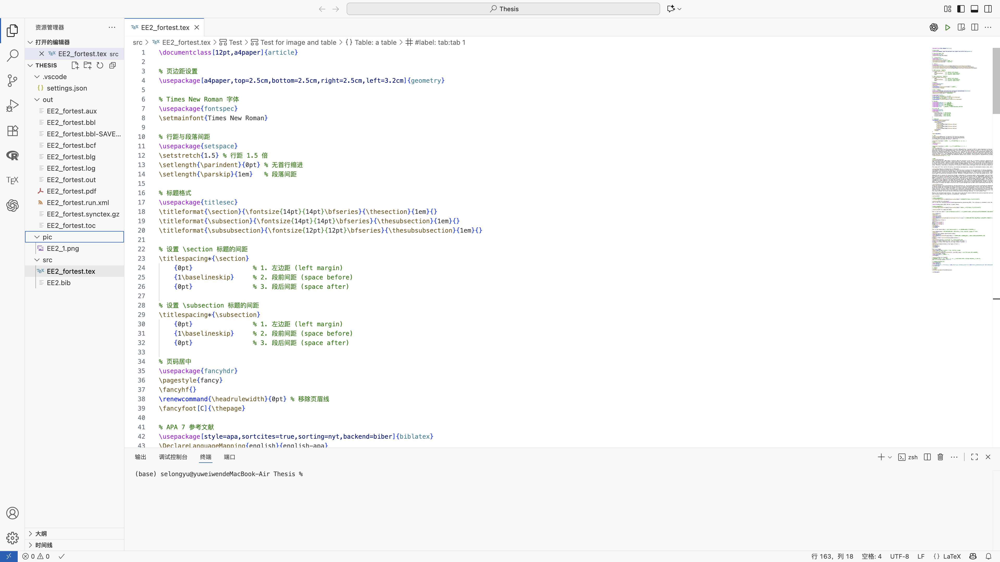
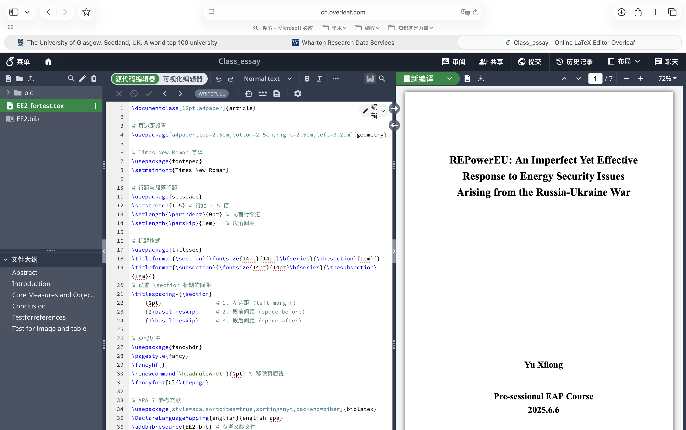
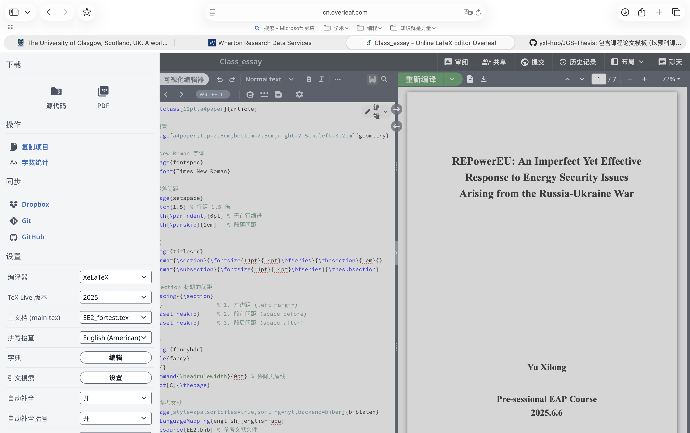
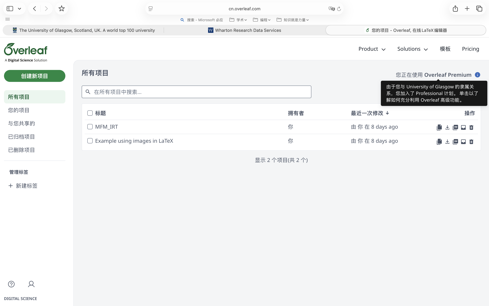
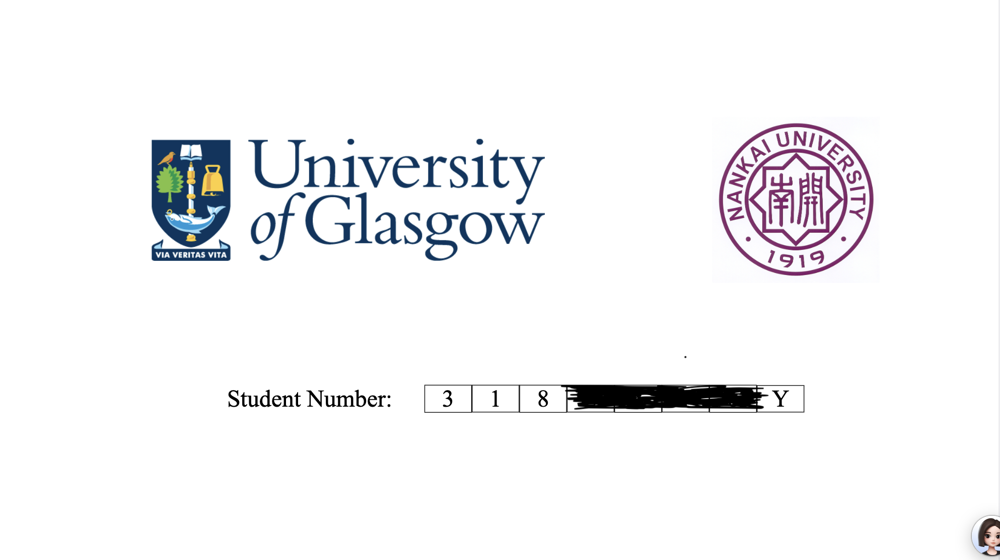

# JGS-Essay
包含课程论文模板（以预科课程论文要求为基准），未来可能包括毕业论文模板。
## 编辑环境配置
> 主要是本地环境和线上环境。前者主推TeXLive+VS Code实现，后者强推Overleaf（格拉斯哥有买相关资源）

### 本地LaTeX环境配置（TeX Live+VS code）
- 主要参考资源
  - [B站--LaTeX 环境配置 (macOS). Strik0r. LaTeX 教程.](https://www.bilibili.com/video/BV1xCNfejEMv?vd_source=03933c815d0479ac0dc2b0f082cd8fb8)
  - [知乎--VS Code 配置 LaTeX 时如何实现源代码与目标文件的分离](https://zhuanlan.zhihu.com/p/24397052814)
- 文件布局及界面如下
  
- 额外说明
  - Thesis文件夹即为本地配置时推荐文件设置，src用于储存LaTeX源码（参考文献也保存于此，推荐使用Zotero），pic用于储存所用图片，out保存输出文件（编译的PDF即保存于此）。
  - 关于Json文件，应该是修改了3处。
    - 第一处：修改了”默认保存即编译“的设置
      ```Json
      "latex-workshop.latex.autoBuild.run": "never"
      ```
    - 第二处：编译默认设置由“上次使用”改为默认“xelatex -> biber -> xelatex*2”
      > LaTeX模板即是使用的该流程xelatex -> biber -> xelatex*2
      ```Json
      "latex-workshop.latex.recipe.default": "xelatex -> biber -> xelatex*2"
      ```
    - 第三处：记得是修改的是否自动删除编译产生的过程文件
      ```Json
      "latex-workshop.latex.autoClean.run": "onSucceeded",
      ```

### Overleaf
- 直接注册使用就好，界面如下
  
- 只需要进入菜单->设置->编译器，修改为XeLaTeX即可
  
- 关于上述提到的订阅，只需要正常注册账号，然后在主页->Solutions->为大学提供->View institutions using Overleaf(下滑)->选择格拉斯哥大学关联账号即可。成功后如下图所示
  
- 使用时如果报错，将输出日志抛给豆包即可解决。如果不行，那就给GPT

## 关于课程论文模版部分说明

- **EE2_fortest**就是模板，里面包含了必要的解释。默认是APA 7的参考样式，尝试改过Moodle中给的Harvard样式，目前使用BibLaTeX基于ext-authoryear或apa 7修改均不能完全实现moodle中给的参考样式（你也可以再次尝试）。或许可以考虑使用natbib宏包实现，但一定记得修改文中的引用命令，同时使用该宏包可能存在潜在的兼容性问题。
  - 文中所有内容仅供示例和测试用。
  - 封面是极简化的，如果你愿意可以做个美美的封面。
    > LLM提示词：如何使用LaTeX设计附件这样的论文封面，两个校徽图片引用使用例子占位展示，只需要给我一个导言区关于封面的设置即可。
    
  

  - 两个紧挨着两级标题之间的空间是自定义调整的（仅为美观）。
  - 测试.bib文件是Zotero导出的，所以导言区加入了忽略note的命令。如果你使用endnote或其他文献管理软件，使用APA 7格式却不完全符合该格式，可在LLM帮助下自行解决。
  - **该仓库并非使用git工具管理，后期维护或更新会比较慢**
- LaTeX听起来很高级，但用起来其实很简单，针对论文这种格式明确的问题尤其适用。在有模板的情况下只需要做点微调，然后填内容就好了，大体框架可以问豆包了解
- 表格和图片（⚠️图片路径）仅进行了部分示例，若想实现复杂实现或者插入表格或图片目录，请自行解决（或在LLM帮助下解决）
- **个人工作流：MarkDown（Typroa）负责所有文字尤其是包括公式的工作，类似于word，但更简化和规范化--或许你已经注意到这个README便是MarkDown格式的；LaTeX（VScode或Overleaf--需要协作使用Overleaf）负责论文写作或Slides制作（极度简化的Slides,Overleaf上有南开大学的相关模版）**。实际操作中可以在MarkDown完成初稿，复制到LaTeX编译即可。
- 补充一点关于**公式编辑**的Tips：公式编辑可以直接使用豆包进行识别，无论是截图也好还是手写，识别率都超级高。效率上来讲较为复杂的公式远比手敲来的快（哪怕Overleaf提供了便捷的编辑方式）。
  - 豆包提示词：本次聊天内容用于识别图片内容并转化为latex公式。输出格式：以$$包裹公式，参考$\frac{1}{2}$。除回答我latex公式外不需要其他任何解释和推荐。不需要渲染，以代码形式输出。
    > 目前来说这个命令对豆包是失效的，对ChatGPT和Gemini来说是没问题的。
# Master's Thesis
[南开硕士论文模板Github仓库地址](https://github.com/NewFuture/NKThesis)

待更新······
